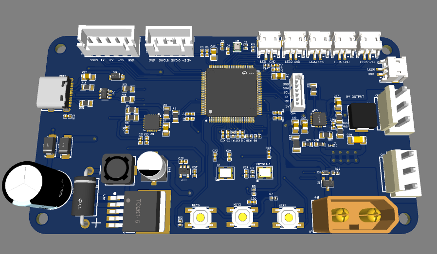
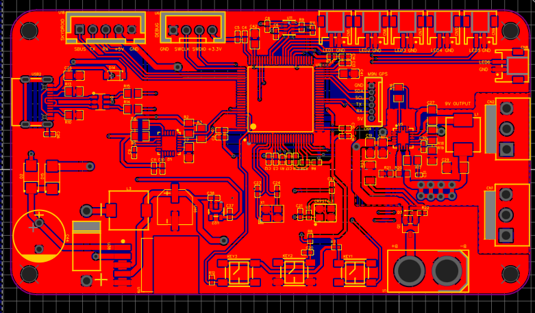
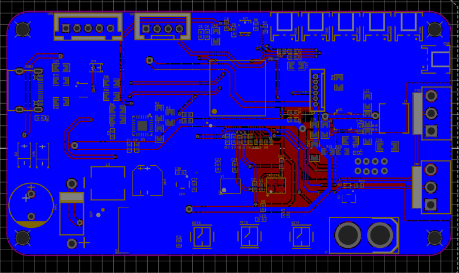
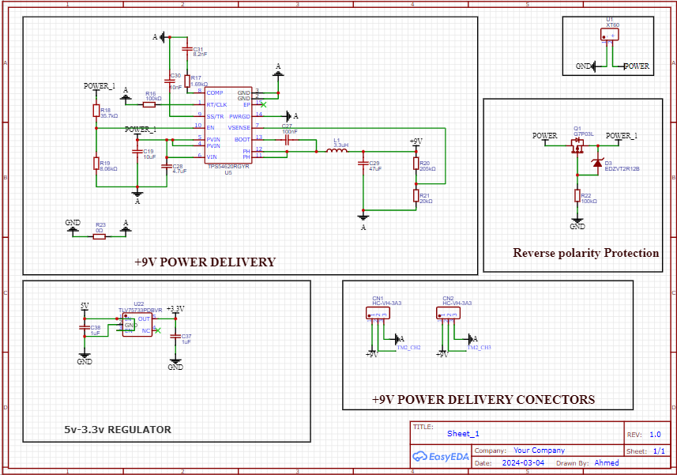
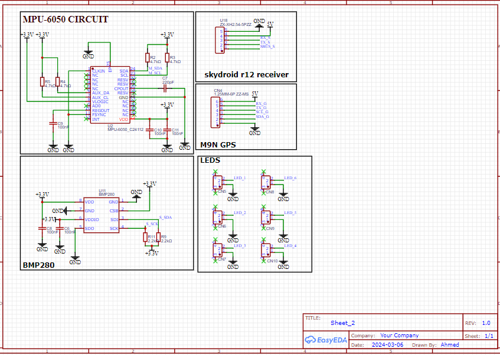
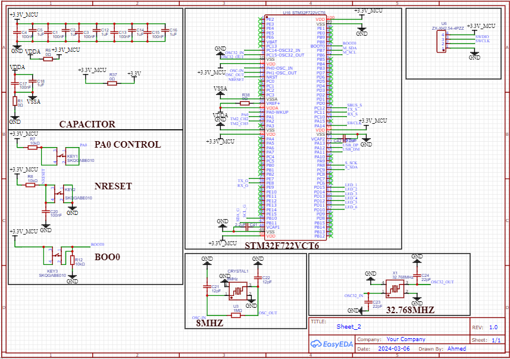
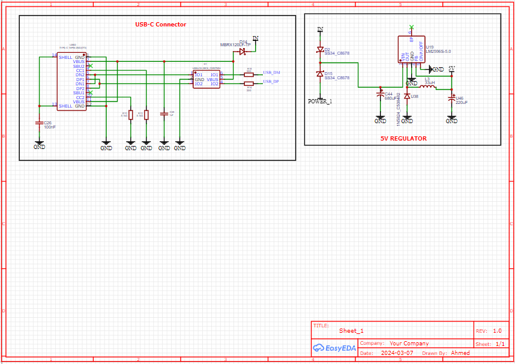

# STM32F7 High-Performance Flight Controller

## Description
This project is a professional-grade **Flight Controller (FC)** based on the high-performance **STM32F722VCT6** microcontroller. It is specifically designed for drones and unmanned aerial vehicles (UAVs) requiring high processing speeds for stable flight and advanced navigation.

## Key Features
* **Core Processor:** STM32F722VCT6 ARM Cortex-M7.
* **Sensor Fusion:** Features the **MPU-6050** 6-axis Gyro/Accelerometer and **BMP280** Barometer for precise altitude and orientation.
* **Navigation Ready:** Integrated port for **M9N GPS** modules.
* **Radio Support:** Built-in connection for **Skydroid R12** receivers.
* **Robust Power:** Includes a **9V Power Delivery** system for VTX and a **5V 3A Regulator** for internal electronics.
* **Protection:** Equipped with **Reverse Polarity Protection** to prevent hardware damage.
* **Interface:** Modern **USB Type-C** connector for configuration and firmware flashing.

---

## Project Gallery

### 1. 3D Preview

### 2. PCB Layout
#### Top Layer

#### Bottom Layer

### 3. Schematic Design
#### Power Management & Protection

#### Sensors & Communication

#### Microcontroller & Clock System

#### USB & Voltage Regulation

---

## Hardware Specifications
* **MCU:** STM32F722VCT6.
* **IMU:** MPU-6050.
* **Barometer:** BMP280.
* **Voltage Regulators:** TPS54620 (9V) and LM2596S (5V).
